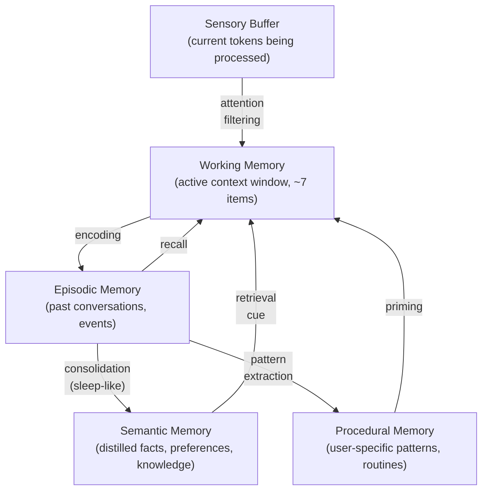
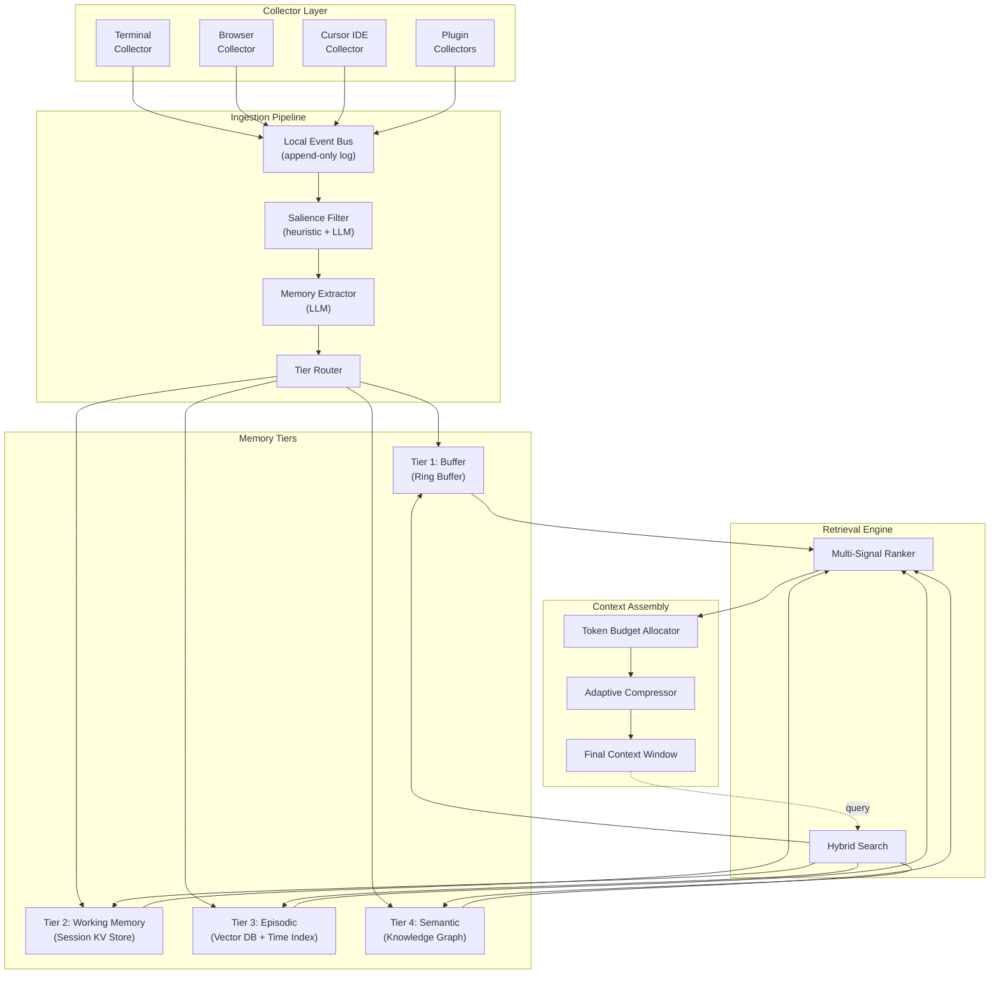
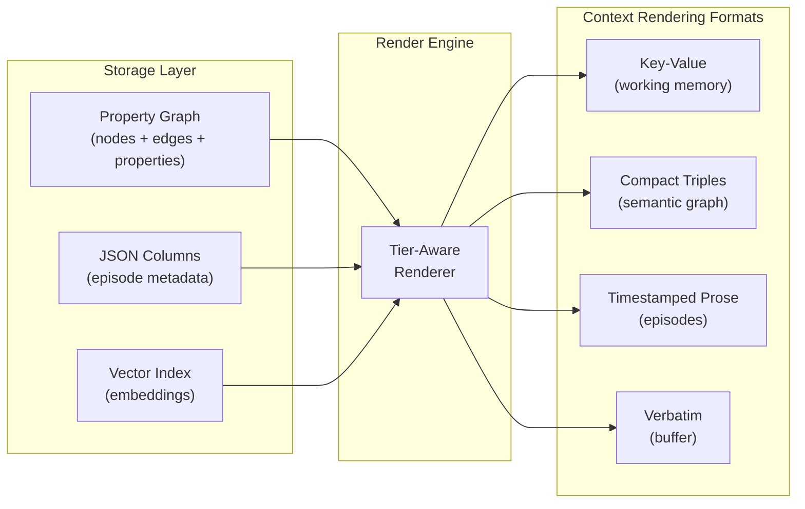
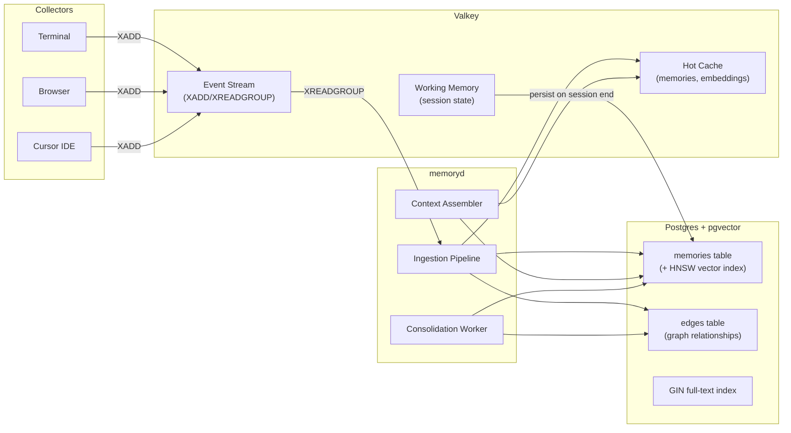
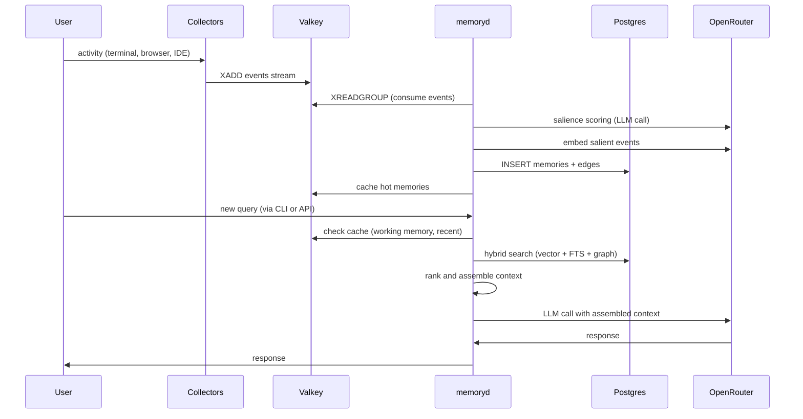
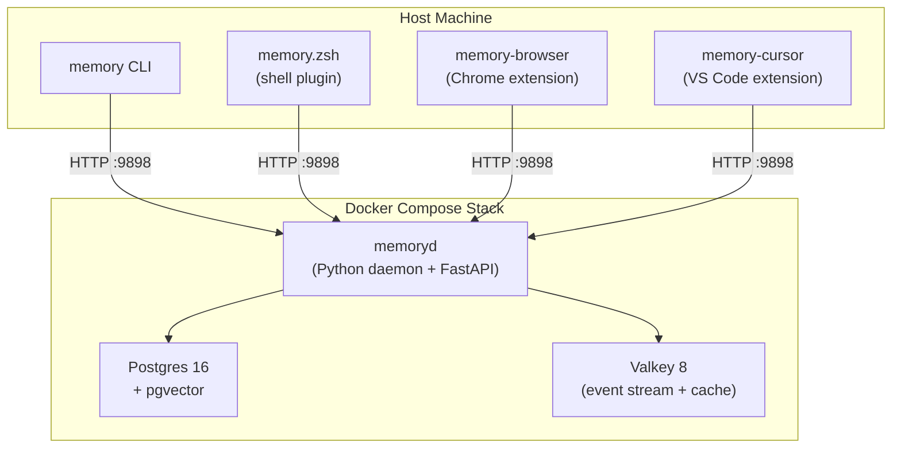
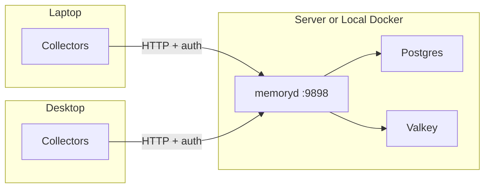

# LLM Memory Architecture: From Transformer Internals to Persistent User Memory

---

## Part 1: Transformer Internals and the Memory Problem

### What Attention Actually Does

In the original "Attention Is All You Need" paper, the core operation is:

```
Attention(Q, K, V) = softmax(QK^T / sqrt(d_k)) V
```

Each token computes a **query** ("what am I looking for?"), and every token produces a **key** ("what do I contain?") and **value** ("here's my information"). The dot product QK^T is a relevance score -- it determines how much each token should attend to every other token. This is the model's **only mechanism for relating tokens to each other**.

This has a critical implication: **the context window IS the model's entire working memory**. There is no other place the model can "look" during inference.

### What Happens During Pre-training

- The model learns to predict the next token given all previous tokens.
- World knowledge, reasoning patterns, and language structure get **compressed into the weights** (the FFN layers store factual associations; attention heads learn relational patterns).
- This is **parametric memory** -- frozen, shared across all users, and not updatable at inference time.

### What Happens During Post-training (SFT, RLHF/DPO)

- The model learns **how to use** its knowledge: instruction following, conversational patterns, safety.
- Minimal new factual knowledge is added. It reshapes access patterns to existing knowledge.

### What Happens During Inference and Generation

1. **KV Cache**: During autoregressive generation, the Key and Value tensors from all previous tokens are cached. This avoids recomputation but grows linearly with sequence length. This cache IS the model's live short-term memory.
2. **Attention as Retrieval**: At each generation step, the new token's Query vector performs a soft lookup against all cached Keys. This is conceptually a **differentiable hash table lookup** -- the model retrieves relevant context from its window.
3. **The Bottleneck**: Even with 128K or 1M token windows, there are hard limits:
  - O(n^2) attention cost (or O(n log n) with sparse variants)
  - Information gets diluted in very long contexts ("lost in the middle" problem)
  - Context is ephemeral -- it vanishes when the session ends
  - Context is not personalized across sessions

### The Core Insight

The transformer has exactly **two memory systems**:


| System                    | Analogy                   | Scope   | Updatable?        | Personalized?       |
| ------------------------- | ------------------------- | ------- | ----------------- | ------------------- |
| Weights (FFN layers)      | Long-term semantic memory | Global  | No (at inference) | No                  |
| KV Cache (context window) | Working memory            | Session | Yes (append-only) | Yes (but ephemeral) |


**There is no native mechanism for persistent, user-specific, cross-session memory.** That's the gap we need to fill.

---

## Part 2: Human Memory as a Blueprint

Human cognition provides the right mental model. The memory system should mirror these tiers:




The key processes: **encoding** (creating memories), **consolidation** (compressing and relating), **retrieval** (finding relevant memories), and **forgetting** (decay of unimportant memories).

---

## Part 3: Collector Layer -- Gathering Context From Everywhere

The memory system is only as good as what it observes. The collector layer is a set of lightweight daemons, plugins, and extensions that watch the user's digital activity and feed normalized events into the memory pipeline.

### Full System Overview




### Common Event Schema

Every collector normalizes raw observations into this unified format before publishing to the event bus:

```python
class SourceEvent:
    id: UUID
    source: str                      # "terminal", "browser", "cursor", "calendar", ...
    event_type: str                  # "command_executed", "page_visited", "file_edited", ...
    timestamp: datetime
    raw_content: str                 # the raw captured text/data
    content_hash: str                # for deduplication
    metadata: dict[str, Any]         # source-specific structured fields
    activity_context: ActivityContext # what the user was doing at the time

class ActivityContext:
    project: str | None              # inferred project/repo
    working_directory: str | None
    active_window: str | None
    session_id: str                  # groups events into logical sessions
    duration_seconds: float | None   # how long the user spent on this
```

### Collector: Terminal

**Mechanism**: A zsh/bash plugin installed via shell integration (precmd/preexec hooks + PROMPT_COMMAND).

**What it captures**:

- Commands run (with working directory and exit code)
- Stderr output (errors are high signal)
- Truncated stdout (capped at ~500 lines to avoid noise)
- Git operations (commit messages, branch switches, diffs)
- Package installations (npm install, pip install, brew install)
- SSH sessions and remote connections
- Environment context (active virtualenv, node version, etc.)

**Signal filtering (heuristic layer)**:

- DROP: repeated `ls`, `cd`, `clear`, navigation noise
- KEEP ALWAYS: errors (non-zero exit), git commits, install/build commands, docker operations
- SAMPLE: general commands (keep 1 in N if repetitive)
- SUMMARIZE: long stdout (e.g., test output -> "42 passed, 3 failed")

```python
class TerminalCollector:
    def on_preexec(self, command: str, cwd: str):
        """Called before a command runs. Start capturing."""

    def on_precmd(self, exit_code: int, stdout: str, stderr: str):
        """Called after a command completes. Emit event if salient."""

    def salience_check(self, command: str, exit_code: int) -> float:
        """Fast heuristic: 0.0 = pure noise, 1.0 = always keep."""
        if exit_code != 0: return 1.0
        if command.startswith(("git commit", "git push")): return 0.9
        if command.startswith(("ls", "cd", "pwd", "clear")): return 0.0
        if "install" in command or "build" in command: return 0.8
        return 0.3  # default: pass to LLM salience filter
```

### Collector: Browser

**Mechanism**: A lightweight browser extension (Chrome/Firefox/Arc) with minimal permissions.

**What it captures**:

- Page URL + title (on page load, with dwell time)
- User-highlighted/selected text
- Search queries (Google, Stack Overflow, GitHub search)
- Bookmarked pages
- GitHub activity: repos visited, PRs/issues viewed, code browsed
- Documentation pages: what docs the user is reading

**Signal filtering**:

- DROP: Social media feeds, ads, entertainment (configurable blocklist)
- DROP: Pages with dwell time < 5 seconds (bounce)
- KEEP ALWAYS: User-highlighted text (explicit signal of interest)
- KEEP ALWAYS: GitHub code/issues the user spends > 30s on
- SUMMARIZE: Long articles -> extract title + key paragraphs

**Privacy controls**:

- Domain allowlist/blocklist (user configurable)
- Never capture form inputs, passwords, or cookie data
- Page content capture is opt-in per domain
- Local-only by default: raw data never leaves the machine

```python
class BrowserCollector:
    allowlist: set[str]              # domains to capture content from
    blocklist: set[str]              # domains to always ignore
    min_dwell_seconds: float = 5.0

    def on_page_load(self, url: str, title: str):
        """Track page visit, start dwell timer."""

    def on_page_leave(self, url: str, dwell_seconds: float):
        """Emit event if dwell > threshold and domain not blocked."""

    def on_text_selected(self, url: str, selected_text: str):
        """Always emit: user selection is an explicit signal of interest."""

    def on_search(self, engine: str, query: str):
        """Emit search query as high-signal event."""
```

### Collector: Cursor IDE

**Mechanism**: A Cursor/VS Code extension that hooks into editor events + reads agent transcript files.

**What it captures**:

- Files opened and edited (with diffs)
- AI conversations (agent transcripts from `agent-transcripts/*.jsonl`)
- Terminal commands run within the IDE
- Search queries (file search, symbol search, grep)
- Linter errors encountered and fixed
- Git activity from the IDE (commits, branch switches, staging)
- Debug sessions (breakpoints hit, variables inspected)
- Extensions/settings changes

**Signal filtering**:

- DROP: Cursor position changes, scroll events, window focus/blur
- KEEP ALWAYS: Code diffs (what was changed and why), AI conversation summaries
- KEEP ALWAYS: Files created/deleted
- SUMMARIZE: Long edit sessions -> "edited auth.py: added JWT validation, fixed token expiry bug"
- BATCH: Rapid successive edits to the same file -> single consolidated event

```python
class CursorCollector:
    debounce_ms: int = 5000          # batch rapid edits

    def on_file_save(self, path: str, diff: str):
        """Emit consolidated edit event with diff summary."""

    def on_agent_transcript(self, transcript_path: str):
        """Parse JSONL transcript, extract conversation summary and decisions."""

    def on_terminal_command(self, command: str, output: str, exit_code: int):
        """Delegate to terminal collector logic."""

    def on_diagnostic_change(self, path: str, errors: list[Diagnostic]):
        """Track error introduction and resolution patterns."""
```

### Collector: Plugin Interface (Extensible)

Any additional source implements this interface:

```python
class Collector(Protocol):
    source_name: str

    def start(self) -> None:
        """Begin observing. Called once at daemon startup."""

    def stop(self) -> None:
        """Stop observing. Clean up resources."""

    def poll(self) -> list[SourceEvent]:
        """Pull-based: return new events since last poll."""

    # OR

    def set_callback(self, cb: Callable[[SourceEvent], None]) -> None:
        """Push-based: register callback for real-time events."""
```

**Potential plugin collectors**:

- **Calendar**: Meeting titles, attendees, duration (via CalDAV or Google Calendar API)
- **Notes**: Obsidian vault changes, Apple Notes (via file system watching)
- **Communication**: Slack channel summaries, email subject lines (never full body without explicit consent)
- **File System**: New documents in ~/Documents, Downloads activity
- **Clipboard**: Repeated clipboard contents (what the user is copy-pasting frequently)

---

## Part 4: The Ingestion Pipeline

### Event Bus

A local, append-only log that all collectors write to. This decouples collection from processing.

**Implementation**: A Valkey Stream (`XADD`/`XREADGROUP`). Collectors push events, the ingestion pipeline consumes them in a consumer group with exactly-once semantics and automatic backpressure.

```python
class EventBus:
    valkey: valkey.asyncio.Valkey
    stream_key: str = "memory:events"
    group_name: str = "ingestion"

    async def publish(self, event: SourceEvent) -> str:
        """XADD event to stream. Returns stream entry ID."""
        return await self.valkey.xadd(self.stream_key, event.to_dict())

    async def consume(self, batch_size: int = 100) -> list[SourceEvent]:
        """XREADGROUP: read unacked events for this consumer group."""
        entries = await self.valkey.xreadgroup(
            self.group_name, "worker-1", {self.stream_key: ">"}, count=batch_size
        )
        return [SourceEvent.from_dict(e) for e in entries]

    async def ack(self, entry_ids: list[str]) -> None:
        """XACK: mark events as processed."""
        await self.valkey.xack(self.stream_key, self.group_name, *entry_ids)
```

### Salience Filter (Two-Stage)

Most raw events are noise. The filter determines what's worth remembering.

**Stage 1 -- Heuristic (fast, no LLM)**:

- Rule-based per source (the `salience_check` methods above)
- Deduplication via content_hash (don't re-ingest the same page visit)
- Rate limiting: if a source is emitting > N events/minute, switch to sampling

**Stage 2 -- LLM-based (batched, async)**:

- Events that pass Stage 1 with a medium score (0.2-0.7) get batched and scored by a cheap/fast LLM
- Prompt: "Given the user's current context and goals, rate the salience of each event 0-10. Only events >= 6 proceed."
- This is where the system learns what the user actually cares about -- the LLM has access to the user's semantic memory (goals, projects, interests) to judge salience

```python
class SalienceFilter:
    def heuristic_filter(self, event: SourceEvent) -> float:
        """Fast rule-based scoring. Returns 0.0 to 1.0."""

    async def llm_filter(self, events: list[SourceEvent],
                          user_context: SemanticMemorySummary) -> list[ScoredEvent]:
        """Batch LLM scoring. Only called for medium-salience events."""
```

### Memory Extractor

Salient events get transformed into structured memories:

```python
class MemoryExtractor:
    async def extract(self, events: list[ScoredEvent]) -> list[ExtractedMemory]:
        """
        LLM call that:
        1. Groups related events (e.g., a sequence of terminal commands for one task)
        2. Extracts atomic facts ("user installed pandas 2.1", "user debugged CORS error")
        3. Identifies entities, topics, and relationships
        4. Assigns an importance score
        5. Generates an embedding for each extracted memory
        """
```

### Tier Router

Decides where each extracted memory goes:

```
if memory is from current active session -> Tier 2 (Working Memory)
if memory is a completed episode/task    -> Tier 3 (Episodic)
if memory is a durable fact/preference   -> Tier 4 (Semantic Graph) directly
                                            (skip episodic for high-confidence facts)
```

---

## Part 5: Memory Tiers (Detail)

### Tier 1: Buffer Memory (Immediate Context)

- **What**: Raw conversation turns from the current exchange
- **Data Structure**: **Ring Buffer** (fixed-size circular array)
- **Capacity**: Last N turns (e.g., 20 turns or ~4K tokens)
- **Eviction**: FIFO -- oldest turns drop off
- **Latency**: O(1) read/write, always in-memory
- **Always injected into context verbatim** (no summarization)

```python
class BufferMemory:
    turns: deque[ConversationTurn]  # maxlen=N
    total_tokens: int
```

### Tier 2: Working Memory (Session-Level)

- **What**: Extracted key-value facts from the current session (entities, decisions, topics, goals)
- **Data Structure**: **Ordered dict** with importance scores + a running **session summary**
- **Updated**: Incrementally after each turn via an extraction prompt
- **Purpose**: Survives buffer overflow. If the conversation is 200 turns long, the working memory retains the important facts even after early turns fall out of the buffer.

```python
class WorkingMemory:
    session_id: str
    summary: str                              # running natural-language summary
    entities: dict[str, EntityInfo]            # extracted entities with metadata
    active_goals: list[Goal]                   # what the user is trying to accomplish
    decisions: list[Decision]                  # choices made in this session
    token_count: int                           # for budget tracking
```

### Tier 3: Episodic Memory (Cross-Session)

- **What**: Compressed representations of past conversations
- **Data Structure**: Each episode is a structured record stored in:
  - **Vector store** (HNSW index) for semantic similarity search
  - **B-tree time index** for temporal queries
  - **Inverted index** for keyword/entity search
- **Created**: At session end (or periodically during long sessions) via a consolidation step
- **Retrieval**: Hybrid search (vector similarity + recency + keyword match)

```python
class EpisodicMemory:
    id: UUID
    conversation_id: str
    summary: str                    # 2-3 sentence summary
    key_facts: list[str]            # extracted atomic facts
    embedding: ndarray              # dense vector (e.g., 1536-dim)
    entities: list[str]             # named entities mentioned
    topics: list[str]               # topic tags
    created_at: datetime
    last_accessed: datetime
    access_count: int
    importance: float               # 0.0 to 1.0
    emotional_valence: float        # -1.0 to 1.0
    links: list[MemoryLink]         # edges to related memories
```

### Tier 4: Semantic Memory (Long-Term Knowledge Graph)

- **What**: Distilled, deduplicated facts about the user -- preferences, background, relationships, beliefs, skills, goals
- **Data Structure**: **Directed labeled property graph** (adjacency list with typed edges)
  - Nodes: entities (the user, people they know, projects, preferences)
  - Edges: typed relationships ("works_on", "prefers", "knows", "dislikes")
  - Properties: confidence scores, source episode IDs, timestamps
- **Updated**: By a **consolidation process** that merges episodic memories into the graph (like memory consolidation during sleep)
- **This is the most valuable tier**: it provides a compact user profile that always fits in context

```python
class SemanticNode:
    id: UUID
    label: str                       # "Python", "prefers dark mode", "works at Acme"
    node_type: str                   # "person", "preference", "skill", "project"
    properties: dict[str, Any]
    confidence: float                # how certain we are about this fact
    source_episodes: list[UUID]      # provenance tracking
    created_at: datetime
    updated_at: datetime

class SemanticEdge:
    source: UUID
    target: UUID
    relation: str                    # "prefers", "works_on", "knows"
    weight: float
    metadata: dict[str, Any]

class KnowledgeGraph:
    nodes: dict[UUID, SemanticNode]
    adjacency: dict[UUID, list[SemanticEdge]]   # adjacency list
    entity_index: dict[str, UUID]               # fast lookup by name
    embedding_index: HNSWIndex                  # vector search over node labels
```

---

## Part 6: Memory Representation -- Storage vs. Rendering

This is a critical architectural decision. The format used to **store** memories (at rest, for querying and updating) must be decoupled from the format used to **render** them into the LLM's context window. They have opposing requirements.

### The Problem With a Single Format

**Markdown** is loose text. It renders nicely for humans but has no structure for machines. You can't run a graph traversal on markdown. You can't update a single fact without rewriting a blob. And `## Heading\n\n- bullet\n- bullet` wastes ~30% of its tokens on formatting syntax that carries zero semantic content.

**JSON** is structured and queryable, which makes it good for storage. But rendering JSON into context is wasteful:

```
Token budget comparison for the same fact:

JSON:    {"user": {"preference": {"language": "TypeScript"}}}   → 14 tokens
Triple:  user --prefers--> TypeScript                           → 6 tokens
Prose:   You prefer TypeScript.                                 → 5 tokens
```

JSON burns tokens on structural punctuation (`{`, `}`, `"`, `:`, nested keys). At scale, this means fewer memories fit in context.

**Raw graph dumps** (RDF N-Triples, adjacency lists) are compact and relational but are a format LLMs were not extensively trained on. The model's attention patterns are optimized for natural language and common structured formats (JSON, XML, markdown), not `<http://example.org/user> <http://example.org/prefers> "TypeScript"^^xsd:string .`

### The Answer: Store as Graph + JSON, Render Adaptively Per Tier




### Storage Format: Property Graph + JSON Columns

All tiers store data in a unified Postgres schema:

```sql
-- Core memory table (covers Tier 2, 3, 4)
CREATE TABLE memories (
    id          UUID PRIMARY KEY,
    tier        TEXT NOT NULL,           -- 'working', 'episodic', 'semantic'
    content     TEXT NOT NULL,           -- natural language summary
    embedding   VECTOR(1536),           -- for similarity search
    facts       JSONB,                  -- structured extracted facts
    metadata    JSONB,                  -- source, timestamps, scores
    importance  REAL DEFAULT 0.5,
    created_at  TIMESTAMP,
    accessed_at TIMESTAMP,
    access_count INTEGER DEFAULT 0
);

-- Graph edges (Tier 4 relationships + cross-tier links)
CREATE TABLE edges (
    source_id   UUID REFERENCES memories(id),
    target_id   UUID REFERENCES memories(id),
    relation    TEXT NOT NULL,           -- 'prefers', 'works_on', 'related_to'
    weight      REAL DEFAULT 1.0,
    metadata    JSONB,
    PRIMARY KEY (source_id, target_id, relation)
);

-- Indices
CREATE INDEX idx_memories_tier ON memories(tier);
CREATE INDEX idx_memories_time ON memories(created_at);
CREATE INDEX idx_memories_embedding ON memories USING hnsw(embedding);
CREATE INDEX idx_edges_source ON edges(source_id);
CREATE INDEX idx_edges_target ON edges(target_id);
CREATE INDEX idx_edges_relation ON edges(relation);
```

The `facts` JSONB column stores structured data specific to each tier:

```python
# Tier 2 (Working Memory) facts example:
{
    "entities": {"auth_service": {"type": "component", "status": "debugging"}},
    "goals": ["fix CORS error", "deploy to staging"],
    "decisions": [{"choice": "use middleware approach", "reason": "simpler than proxy"}]
}

# Tier 3 (Episodic) facts example:
{
    "key_facts": [
        "debugged CORS issue in auth service",
        "root cause was missing Allow-Origin header",
        "fixed by adding express middleware"
    ],
    "source": "cursor",
    "conversation_id": "abc123"
}

# Tier 4 (Semantic) facts example:
{
    "node_type": "preference",
    "subject": "user",
    "predicate": "prefers",
    "object": "TypeScript over JavaScript",
    "confidence": 0.92,
    "evidence_count": 7
}
```

**Why this hybrid**: The relational table gives us B-tree indices for time queries, the JSONB column gives us flexible per-tier structure without schema migrations, the vector column gives us similarity search, and the edges table gives us a proper graph. One storage engine, four access patterns.

### Rendering Format: Tier-Adaptive Context Serialization

Each tier renders into a different compact format optimized for LLM comprehension and token efficiency.

**Tier 1 (Buffer) -- Verbatim conversation turns**:
No transformation. Raw user/assistant messages exactly as they occurred. This is what the model expects and attends to best.

**Tier 2 (Working Memory) -- Key-value block**:

```
<working_memory>
session: memory architecture design discussion
goals: [design storage format, finalize rendering strategy]
context: evaluating JSON vs graph vs markdown for memory storage
entities: {enterprise_skills: project, Postgres+pgvector: storage}
decisions: [multi-tier architecture, hybrid search retrieval]
</working_memory>
```

Compact, scannable, every line is information-dense. XML-like delimiters cost few tokens but give the model clear boundaries. The model sees this as structured metadata it can reference.

**Tier 3 (Episodic) -- Timestamped prose fragments**:

```
<episodes>
[Mar 8, cursor, 0.85] Designed collector interfaces for terminal, browser, and IDE. Terminal uses zsh hooks, browser uses Chrome extension with Native Messaging. Using Valkey streams for event bus.
[Mar 7, terminal, 0.72] Set up Docker Compose for local dev: postgres, redis, api services. Debugged port conflict on 5432.
[Mar 5, browser, 0.65] Researched HNSW algorithm for approximate nearest neighbor search. Read Pinecone docs on vector index tuning.
</episodes>
```

Each episode is one line: `[date, source, importance] natural language summary`. This is extremely token-efficient (~20-40 tokens per episode) while giving the model temporal ordering, source attribution, and importance signal. Natural language summaries are what transformers attend to best.

**Tier 4 (Semantic Graph) -- Compact triple notation**:

```
<user_knowledge>
user --works_on--> enterprise_skills (project, active)
user --prefers--> TypeScript (language, confidence: 0.92)
user --prefers--> dark_mode (ui, confidence: 0.88)
user --skilled_in--> Python (language, confidence: 0.95)
user --knows--> Alice (person, role: tech lead)
user --interested_in--> transformer_architecture (topic, recent)
enterprise_skills --uses--> Postgres_pgvector (storage)
enterprise_skills --uses--> pgvector (vector search)
Alice --works_on--> enterprise_skills
</user_knowledge>
```

Each line is a triple: `subject --relation--> object (type, properties)`. This is:

- **Token-efficient**: ~8-12 tokens per fact
- **Relational**: The model can follow edges (if user works_on X and X uses Y, the model infers user works with Y)
- **Familiar**: Arrow notation is common in training data (documentation, diagrams, code comments)
- **Scannable**: The model's attention can pick out relevant triples without parsing nested structure

### Token Budget Comparison

For 50 facts about a user:


| Format                       | Approximate Tokens | Information Density                   |
| ---------------------------- | ------------------ | ------------------------------------- |
| Markdown (headers + bullets) | ~800               | Low (30% formatting overhead)         |
| JSON (nested objects)        | ~700               | Medium (25% structural punctuation)   |
| Compact triples              | ~500               | High (minimal syntax overhead)        |
| Prose paragraphs             | ~450               | High but harder to scan/retrieve from |


The compact triple format wins for structured facts. Prose wins for narrative episodes. The tier-adaptive approach uses each format where it's strongest.

### The Render Engine

```python
class MemoryRenderer:
    def render(self, memories: list[Memory], budget: int) -> str:
        sections = []

        # Group by tier, render each with its format
        by_tier = group_by(memories, key=lambda m: m.tier)

        if "working" in by_tier:
            sections.append(self.render_working(by_tier["working"]))

        if "semantic" in by_tier:
            sections.append(self.render_triples(by_tier["semantic"]))

        if "episodic" in by_tier:
            sections.append(self.render_episodes(by_tier["episodic"]))

        rendered = "\n".join(sections)

        # If over budget, progressively compress
        while token_count(rendered) > budget:
            rendered = self.compress(rendered, budget)

        return rendered

    def render_triples(self, nodes: list[Memory]) -> str:
        """Render semantic graph nodes as compact triples."""
        lines = ["<user_knowledge>"]
        for node in nodes:
            facts = node.facts
            edges = self.get_edges(node.id)
            for edge in edges:
                target = self.get_node(edge.target_id)
                props = f"({facts.get('node_type', '')}"
                if facts.get('confidence'):
                    props += f", confidence: {facts['confidence']:.2f}"
                props += ")"
                lines.append(
                    f"{node.content} --{edge.relation}--> {target.content} {props}"
                )
        lines.append("</user_knowledge>")
        return "\n".join(lines)

    def render_episodes(self, episodes: list[Memory]) -> str:
        """Render episodic memories as timestamped prose."""
        lines = ["<episodes>"]
        for ep in sorted(episodes, key=lambda e: e.created_at, reverse=True):
            date = ep.created_at.strftime("%b %d")
            source = ep.metadata.get("source", "?")
            lines.append(
                f"[{date}, {source}, {ep.importance:.2f}] {ep.content}"
            )
        lines.append("</episodes>")
        return "\n".join(lines)
```

### Progressive Compression

When the rendered context exceeds the token budget, the renderer compresses progressively:

1. **Truncate low-importance episodes** (drop the tail of the ranked list)
2. **Collapse semantic triples** by subgraph: group related triples into prose summaries ("User is a Python/TypeScript developer working on enterprise_skills, prefers dark mode")
3. **Summarize episode clusters**: merge temporally adjacent episodes into a single summary
4. **Last resort**: Reduce the entire memory block to a single paragraph summary via LLM

This guarantees the system works with ANY context length -- from 4K to 1M tokens. Small windows get a compressed user profile + recent context. Large windows get the full richness.

---

## Part 7: Key Algorithms

### Memory Retrieval Scoring (inspired by Generative Agents, Park et al. 2023)

```
score(memory, query) = alpha * relevance + beta * recency + gamma * importance
```

Where:

- **relevance** = `cosine_similarity(embed(query), memory.embedding)` -- semantic match
- **recency** = `exp(-decay * (now - memory.last_accessed))` -- exponential decay
- **importance** = `memory.importance * log(1 + memory.access_count)` -- reinforced by use
- alpha, beta, gamma are tunable weights (could themselves be learned or context-dependent)

### Context Assembly Algorithm (the critical path)

This is the algorithm that runs before every LLM call:

```
function assemble_context(query, model_context_length):
    budget = model_context_length
    context = []

    # 1. System prompt (fixed cost)
    context.append(system_prompt)
    budget -= token_count(system_prompt)

    # 2. User profile from semantic memory (always included, highly compressed)
    profile = knowledge_graph.generate_user_summary()
    context.append(profile)
    budget -= token_count(profile)

    # 3. Buffer memory -- recent turns (always included verbatim)
    recent = buffer.get_all()
    context.append(recent)
    budget -= token_count(recent)

    # 4. Working memory -- session context
    session_ctx = working_memory.serialize()
    context.append(session_ctx)
    budget -= token_count(session_ctx)

    # 5. Retrieve from episodic + semantic memory
    candidates = hybrid_search(query, top_k=50)
    ranked = score_and_rank(candidates, query)

    # 6. Greedily fill remaining budget
    for memory in ranked:
        if budget <= 0:
            break
        text = memory.to_text()
        if token_count(text) <= budget:
            context.append(text)
            budget -= token_count(text)
        else:
            # Compress to fit
            compressed = summarize(text, max_tokens=budget)
            context.append(compressed)
            budget = 0

    return context
```

### Memory Consolidation (Async, runs periodically or post-session)

```mermaid
graph TD
    episodes["Recent Episodic<br/>Memories"]
    extract["Fact Extraction<br/>(LLM call)"]
    dedup["Deduplication<br/>(embedding similarity)"]
    merge["Merge/Update<br/>Existing Nodes"]
    createNew["Create New<br/>Graph Nodes"]
    decay["Decay Unaccessed<br/>Memories"]
    prune["Prune Low-Confidence<br/>Nodes"]
    graph["Updated Knowledge<br/>Graph"]

    episodes --> extract
    extract --> dedup
    dedup --> merge
    dedup --> createNew
    merge --> graph
    createNew --> graph
    graph --> decay
    decay --> prune
    prune --> graph
```


1. **Extract**: From recent episodes, extract atomic facts using an LLM ("User prefers TypeScript over JavaScript", "User is building a CLI tool")
2. **Deduplicate**: Compare new facts against existing graph nodes using embedding similarity. If similarity > threshold, it's an update, not a new fact.
3. **Merge or Create**: Update confidence scores of existing nodes, or create new nodes/edges.
4. **Decay**: Reduce confidence of nodes not referenced in recent episodes.
5. **Prune**: Remove nodes below a confidence threshold (forgetting).

---

## Part 8: Data Structure Summary


| Component         | Primary Data Structure                                                      | Why                                                                     |
| ----------------- | --------------------------------------------------------------------------- | ----------------------------------------------------------------------- |
| Buffer Memory     | **Ring Buffer** (circular deque)                                            | O(1) append/evict, fixed size, preserves order                          |
| Working Memory    | **Ordered Dict** + running summary                                          | Fast key lookup, preserves insertion order                              |
| Episodic Store    | **HNSW Index** (vector) + **B-tree** (time) + **Inverted Index** (keywords) | Each index optimizes a different retrieval pattern                      |
| Semantic Store    | **Property Graph** (adjacency list) + **HNSW Index**                        | Graph traversal for relationships, vector search for semantic queries   |
| Retrieval Ranking | **Min-Heap / Priority Queue**                                               | Efficient top-k selection from scored candidates                        |
| Quick Topic Check | **Bloom Filter**                                                            | O(1) probabilistic "have we discussed X?" check before expensive search |
| Context Assembly  | **Token Budget Allocator** (greedy knapsack)                                | Maximize information density within a hard token limit                  |


---

## Part 9: Why This Is Not Just RAG

Standard RAG retrieves chunks from a static document store. This system is fundamentally different:

- **Active memory creation**: Memories are extracted and structured from conversations, not pre-chunked documents
- **Consolidation**: Episodic memories get distilled into semantic facts over time (like human sleep)
- **Forgetting**: Memories decay and get pruned -- this is a feature, not a bug. It keeps the knowledge graph focused.
- **Relational structure**: The knowledge graph captures relationships between facts, not just isolated chunks
- **Multi-signal retrieval**: Relevance + recency + importance, not just vector similarity
- **Adaptive compression**: Context assembly adapts to any model's context window by compressing lower-priority memories
- **Bi-directional**: The system both reads from and writes to memory on every turn

---

## Part 10: Concrete Technology Choices (Implementation)

### Infrastructure: Postgres + Valkey + Docker

The entire backend runs as a Docker Compose stack. No "install Postgres on your machine" -- one `docker compose up` brings up everything.

**Postgres (with pgvector)** is the single source of truth. It replaces what would otherwise be 4 separate systems:

- **Vector search**: pgvector extension provides HNSW indices for embedding similarity -- no need for a separate Qdrant/Weaviate
- **Graph storage**: The `edges` table + recursive CTEs for graph traversal -- no need for Neo4j
- **Full-text search**: GIN index with `tsvector` for keyword/entity search -- no need for Elasticsearch
- **Time-series queries**: B-tree indices on timestamps
- **Event bus**: `LISTEN`/`NOTIFY` for real-time event streaming from collectors to the ingestion pipeline -- replaces polling a SQLite file
- **ACID transactions**: Memory consolidation (read episodic, write semantic, delete stale) happens atomically

One database, four access patterns, zero operational overhead beyond the container.

**Valkey** (the Redis fork, post-license) serves three roles that Postgres is bad at:

- **Hot cache**: Recently accessed memories and pre-computed embeddings. The context assembly algorithm runs on every LLM call -- it needs sub-millisecond reads for the user profile and working memory, not a Postgres round-trip.
- **Event stream**: Collectors push `SourceEvent` entries to a Valkey Stream (`XADD`). The ingestion pipeline consumes with `XREADGROUP` (consumer groups give us exactly-once processing, backpressure, and dead-letter handling). This is faster and more robust than Postgres `LISTEN`/`NOTIFY` for high-throughput event ingestion.
- **Session state**: Tier 2 Working Memory lives in Valkey. It's ephemeral, fast-mutating, and read on every request -- a perfect fit for an in-memory store. On session end, it gets persisted to Postgres as an episodic memory.
- **Rate limiting**: Per-collector rate limits via `INCR`/`EXPIRE` to prevent runaway collectors from flooding the pipeline.




### Model Provider: OpenRouter

Instead of wiring up separate clients for OpenAI, Anthropic, Google, etc., all model calls go through **OpenRouter**. One API key, access to every model.

```python
class ModelProvider:
    """All LLM and embedding calls route through OpenRouter."""
    base_url = "https://openrouter.ai/api/v1"

    def __init__(self, api_key: str, config: ModelConfig):
        self.api_key = api_key
        self.config = config

    async def embed(self, texts: list[str]) -> list[list[float]]:
        """Embedding call via OpenRouter."""
        return await self._call(
            model=self.config.embedding_model,
            endpoint="/embeddings",
            input=texts,
        )

    async def complete(self, messages: list[dict], **kwargs) -> str:
        """Chat completion via OpenRouter."""
        return await self._call(
            model=self.config.llm_model,
            endpoint="/chat/completions",
            messages=messages,
            **kwargs,
        )
```

The config lets users pick any model available on OpenRouter:

```toml
[models]
provider = "openrouter"
api_key = "sk-or-..."                         # single key for everything

# Model assignments -- user picks what they want
embedding_model = "openai/text-embedding-3-small"
extraction_model = "anthropic/claude-3.5-haiku" # salience filtering, fact extraction
consolidation_model = "anthropic/claude-3.5-haiku" # memory consolidation
```

**Why OpenRouter over direct provider APIs**:

- **One API key**: User manages one credential, not three
- **Model flexibility**: User can swap `anthropic/claude-3.5-haiku` for `google/gemini-2.0-flash` or `meta-llama/llama-3.3-70b-instruct` without code changes
- **Fallback routing**: OpenRouter can auto-fallback to alternate providers if one is down
- **Cost visibility**: Single dashboard for all model spend
- **Future-proof**: New models appear on OpenRouter without us shipping an update

### Collectors

- **Terminal**: zsh plugin using `precmd`/`preexec` hooks, pushes events to Valkey stream via the daemon's HTTP API (or directly via `valkey-cli` if available)
- **Browser**: Chrome extension (Manifest V3) with minimal permissions (`tabs`, `activeTab`). Communicates via Native Messaging host to the daemon.
- **Cursor IDE**: VS Code extension that watches `agent-transcripts/` via `fs.watch`, hooks into workspace events, pushes to daemon HTTP API
- **Plugin SDK**: A Python or TypeScript package providing the `Collector` protocol + Valkey/HTTP event push client

### Orchestration

- **memoryd** (Python, async): The daemon process that:
  - Consumes the Valkey event stream (XREADGROUP)
  - Runs salience filter + memory extraction in async batches
  - Runs periodic consolidation (configurable interval)
  - Exposes a local HTTP API (FastAPI) for context assembly and CLI commands
  - Manages Valkey cache invalidation and Postgres connection pooling (asyncpg)
- **memory** (CLI): Talks to memoryd's HTTP API. Stateless.
- **Privacy**: All data in local Docker volumes. Optional Postgres encryption via TDE or volume-level encryption. User can `memory forget`, `memory export`, or `docker compose down -v` to nuke everything.

### Data Flow Summary




---

## Part 11: Distribution and Deployment

### Design Principles

1. **Zero-to-working in one command**: `curl -fsSL https://memory.dev/install.sh | bash`
2. **Docker-native**: Postgres, Valkey, and the daemon all run as containers. The only host requirement is Docker.
3. **One API key**: OpenRouter key is the only credential needed. Gives access to every model.
4. **Single data directory**: Everything lives in `~/.memory/` -- config, logs, plugins, Docker volumes. One directory to reason about.
5. **Runs on macOS and Linux**: Both arm64 and x86_64. Windows via WSL2.

### Component Map




The Docker stack (daemon + Postgres + Valkey) is the core. The host-side components (CLI, collectors) are thin clients that push events and query the daemon over HTTP on localhost:9898.

### Directory Layout

```
~/.memory/
├── config.toml                    # user configuration
├── docker-compose.yml             # generated compose file
├── .env                           # OPENROUTER_API_KEY (gitignored)
├── logs/
│   └── memoryd.log                # daemon logs (also in docker logs)
├── plugins/
│   ├── terminal/
│   │   └── memory.zsh             # zsh plugin (sourced by .zshrc)
│   ├── browser/
│   │   └── native-messaging.json  # Chrome Native Messaging manifest
│   └── cursor/
│       └── memory-cursor.vsix     # VS Code extension package
├── bin/
│   └── memory                     # CLI binary (talks to daemon HTTP API)
└── backups/
    └── 2026-03-09.sql.gz          # periodic pg_dump backups
```

Data lives in Docker volumes (`memory-pg-data`, `memory-valkey-data`), not in `~/.memory/data/`. This means Postgres manages its own storage, WAL, and vacuuming properly -- no SQLite file-locking issues, no size limits, proper concurrent access.

### config.toml

```toml
[core]
log_level = "info"

[daemon]
host = "0.0.0.0"
port = 9898
consolidation_interval_minutes = 30

[postgres]
host = "postgres"                          # Docker service name
port = 5432
database = "memory"
user = "memory"
# password sourced from MEMORY_PG_PASSWORD env var
pool_min = 2
pool_max = 10

[valkey]
host = "valkey"                            # Docker service name
port = 6379
# password sourced from MEMORY_VALKEY_PASSWORD env var
event_stream = "memory:events"            # stream key for collector events
cache_ttl_seconds = 3600                   # hot cache TTL
working_memory_ttl_seconds = 86400         # session state expires after 24h

[models]
provider = "openrouter"
# API key sourced from OPENROUTER_API_KEY env var

embedding_model = "openai/text-embedding-3-small"
extraction_model = "anthropic/claude-3.5-haiku"
consolidation_model = "anthropic/claude-3.5-haiku"

# Cost guardrails
max_daily_spend_usd = 5.00
max_tokens_per_extraction = 1000

[collectors]
terminal = true
browser = false                            # opt-in
cursor = true

[privacy]
browser_blocklist = ["*.bank.com", "mail.google.com", "*.1password.com"]
```

### docker-compose.yml

```yaml
services:
  memoryd:
    image: ghcr.io/your-org/memory:latest
    ports:
      - "127.0.0.1:9898:9898"
    volumes:
      - ${MEMORY_HOME:-~/.memory}/config.toml:/etc/memory/config.toml:ro
      - ${MEMORY_HOME:-~/.memory}/logs:/var/log/memory
    environment:
      - OPENROUTER_API_KEY=${OPENROUTER_API_KEY}
      - MEMORY_PG_PASSWORD=${MEMORY_PG_PASSWORD:-memory}
      - MEMORY_VALKEY_PASSWORD=${MEMORY_VALKEY_PASSWORD:-}
    depends_on:
      postgres:
        condition: service_healthy
      valkey:
        condition: service_healthy
    restart: unless-stopped
    healthcheck:
      test: ["CMD", "curl", "-f", "http://localhost:9898/health"]
      interval: 15s
      timeout: 5s
      retries: 3

  postgres:
    image: pgvector/pgvector:pg16
    environment:
      POSTGRES_DB: memory
      POSTGRES_USER: memory
      POSTGRES_PASSWORD: ${MEMORY_PG_PASSWORD:-memory}
    volumes:
      - memory-pg-data:/var/lib/postgresql/data
    healthcheck:
      test: ["CMD-SHELL", "pg_isready -U memory"]
      interval: 5s
      timeout: 3s
      retries: 5
    restart: unless-stopped

  valkey:
    image: valkey/valkey:8-alpine
    command: >
      valkey-server
      --maxmemory 256mb
      --maxmemory-policy allkeys-lru
      --appendonly yes
    volumes:
      - memory-valkey-data:/data
    healthcheck:
      test: ["CMD", "valkey-cli", "ping"]
      interval: 5s
      timeout: 3s
      retries: 5
    restart: unless-stopped

volumes:
  memory-pg-data:
  memory-valkey-data:
```

Key details:

- Daemon only binds to `127.0.0.1:9898` -- not exposed to the network by default
- Postgres and Valkey have no published ports -- only reachable from within the Docker network
- Valkey is capped at 256MB with LRU eviction -- it's a cache, not the source of truth
- Valkey has AOF persistence enabled so event streams survive restarts (no lost events)
- All three services have health checks and `restart: unless-stopped`

### The Installer Script

```bash
#!/usr/bin/env bash
# install.sh -- one-command installer for the memory system
set -euo pipefail

MEMORY_HOME="${MEMORY_HOME:-$HOME/.memory}"
REPO="your-org/memory"
VERSION="${1:-latest}"

main() {
    detect_platform
    check_docker
    prompt_api_key
    create_directory_structure
    write_compose_file
    write_default_config
    start_stack
    install_cli
    setup_collectors
    run_migrations
    verify
    print_success
}

detect_platform() {
    OS="$(uname -s | tr '[:upper:]' '[:lower:]')"
    ARCH="$(uname -m)"
    case "$ARCH" in
        x86_64)        ARCH="amd64" ;;
        arm64|aarch64) ARCH="arm64" ;;
        *) fail "Unsupported architecture: $ARCH" ;;
    esac
    log "Platform: $OS/$ARCH"
}

check_docker() {
    if ! command -v docker &>/dev/null; then
        fail "Docker is required. Install from https://docs.docker.com/get-docker/"
    fi
    if ! docker compose version &>/dev/null; then
        fail "Docker Compose v2 is required. Update Docker Desktop or install the compose plugin."
    fi
    if ! docker info &>/dev/null 2>&1; then
        fail "Docker daemon is not running. Start Docker Desktop or the docker service."
    fi
    log "Docker OK: $(docker compose version --short)"
}

prompt_api_key() {
    ENV_FILE="$MEMORY_HOME/.env"
    if [ -f "$ENV_FILE" ] && grep -q "OPENROUTER_API_KEY" "$ENV_FILE"; then
        log "OpenRouter API key already configured"
        return
    fi

    echo ""
    echo "  The memory system uses OpenRouter for model access."
    echo "  Get a key at: https://openrouter.ai/keys"
    echo ""
    read -rp "  OpenRouter API key (sk-or-...): " API_KEY

    if [ -z "$API_KEY" ]; then
        fail "API key is required. Get one at https://openrouter.ai/keys"
    fi

    mkdir -p "$MEMORY_HOME"
    cat > "$ENV_FILE" <<EOF
OPENROUTER_API_KEY=$API_KEY
MEMORY_PG_PASSWORD=$(openssl rand -hex 16)
EOF
    chmod 600 "$ENV_FILE"
    log "Credentials saved to $ENV_FILE"
}

create_directory_structure() {
    mkdir -p "$MEMORY_HOME"/{logs,plugins/terminal,plugins/browser,plugins/cursor,bin,backups}
    log "Directory structure created at $MEMORY_HOME"
}

write_compose_file() {
    # Download or generate the compose file
    curl -fsSL "https://raw.githubusercontent.com/$REPO/main/docker-compose.yml" \
        -o "$MEMORY_HOME/docker-compose.yml" 2>/dev/null \
    || {
        log "Generating docker-compose.yml locally"
        # (embedded compose file as fallback -- content as shown above)
    }
}

write_default_config() {
    if [ ! -f "$MEMORY_HOME/config.toml" ]; then
        curl -fsSL "https://raw.githubusercontent.com/$REPO/main/config.default.toml" \
            -o "$MEMORY_HOME/config.toml" 2>/dev/null \
        || {
            log "Generating default config.toml"
            # (embedded default config as fallback)
        }
    fi
}

start_stack() {
    log "Starting Docker stack (postgres + valkey + memoryd)..."
    docker compose --project-directory "$MEMORY_HOME" \
        --env-file "$MEMORY_HOME/.env" \
        up -d

    log "Waiting for services to be healthy..."
    local retries=30
    while [ $retries -gt 0 ]; do
        if docker compose --project-directory "$MEMORY_HOME" \
            ps --format json 2>/dev/null | grep -q '"healthy"'; then
            break
        fi
        sleep 2
        retries=$((retries - 1))
    done

    if [ $retries -eq 0 ]; then
        warn "Services may not be fully healthy yet. Check: docker compose -f $MEMORY_HOME/docker-compose.yml logs"
    fi
}

install_cli() {
    log "Installing memory CLI"
    # Download pre-built binary for platform
    CLI_URL="https://github.com/$REPO/releases/download/$VERSION/memory-$OS-$ARCH"
    curl -fsSL "$CLI_URL" -o "$MEMORY_HOME/bin/memory" 2>/dev/null \
    || {
        # Fallback: install via pip
        log "Binary not available, installing via pip"
        python3 -m pip install --quiet "memory-cli" 2>/dev/null
        ln -sf "$(python3 -m pip show memory-cli | grep Location | cut -d' ' -f2)/../../../bin/memory" \
            "$MEMORY_HOME/bin/memory"
    }
    chmod +x "$MEMORY_HOME/bin/memory"
}

setup_collectors() {
    # Terminal collector: zsh plugin
    cat > "$MEMORY_HOME/plugins/terminal/memory.zsh" <<'ZSH'
# memory.zsh -- terminal collector for the memory system
MEMORY_API="http://127.0.0.1:9898/api/v1/events"

_memory_preexec() {
    _MEMORY_CMD="$1"
    _MEMORY_CWD="$PWD"
    _MEMORY_START=$EPOCHSECONDS
}

_memory_precmd() {
    local exit_code=$?
    [[ -z "${_MEMORY_CMD:-}" ]] && return

    # Fire and forget -- don't slow down the prompt
    curl -sS -X POST "$MEMORY_API" \
        -H "Content-Type: application/json" \
        -d "{
            \"source\": \"terminal\",
            \"event_type\": \"command_executed\",
            \"content\": $(printf '%s' "$_MEMORY_CMD" | jq -Rs .),
            \"metadata\": {
                \"exit_code\": $exit_code,
                \"cwd\": \"$_MEMORY_CWD\",
                \"duration_seconds\": $(( EPOCHSECONDS - _MEMORY_START ))
            }
        }" &>/dev/null &

    unset _MEMORY_CMD
}

autoload -Uz add-zsh-hook
add-zsh-hook preexec _memory_preexec
add-zsh-hook precmd _memory_precmd
ZSH

    # Add to .zshrc if not already present
    ZSHRC="$HOME/.zshrc"
    HOOK='[[ -f "$HOME/.memory/plugins/terminal/memory.zsh" ]] && source "$HOME/.memory/plugins/terminal/memory.zsh"'
    if ! grep -qF ".memory/plugins/terminal" "$ZSHRC" 2>/dev/null; then
        echo "" >> "$ZSHRC"
        echo "$HOOK" >> "$ZSHRC"
        log "Terminal collector added to .zshrc (restart shell or: source ~/.zshrc)"
    fi

    # Cursor extension
    if command -v cursor &>/dev/null || command -v code &>/dev/null; then
        local cmd="cursor"
        command -v cursor &>/dev/null || cmd="code"
        if curl -fsSL "https://github.com/$REPO/releases/download/$VERSION/memory-cursor.vsix" \
            -o "$MEMORY_HOME/plugins/cursor/memory-cursor.vsix" 2>/dev/null; then
            $cmd --install-extension "$MEMORY_HOME/plugins/cursor/memory-cursor.vsix" --force 2>/dev/null
            log "Cursor/VS Code extension installed"
        fi
    fi

    # Browser: setup Native Messaging host
    "$MEMORY_HOME/bin/memory" setup-native-host 2>/dev/null \
        || log "Browser native messaging setup skipped (install extension from Chrome Web Store)"
}

run_migrations() {
    log "Running database migrations..."
    docker compose --project-directory "$MEMORY_HOME" \
        exec -T memoryd memory-migrate 2>/dev/null \
    || "$MEMORY_HOME/bin/memory" migrate 2>/dev/null \
    || warn "Migrations will run on first daemon request"
}

verify() {
    sleep 2
    if "$MEMORY_HOME/bin/memory" status &>/dev/null; then
        log "System is healthy"
        "$MEMORY_HOME/bin/memory" status
    else
        warn "Daemon not responding yet. Check: docker compose --project-directory $MEMORY_HOME logs memoryd"
    fi
}

print_success() {
    cat <<EOF

  Memory system installed successfully.

  Add to your PATH (add to .zshrc/.bashrc):

    export PATH="\$HOME/.memory/bin:\$PATH"

  Quick start:

    memory status            # system health
    memory search "topic"    # search your memories
    memory graph             # knowledge graph stats
    memory export            # full backup (JSON)

  Manage the stack:

    cd ~/.memory && docker compose logs -f   # live logs
    cd ~/.memory && docker compose restart   # restart all
    cd ~/.memory && docker compose down      # stop all
    cd ~/.memory && docker compose down -v   # nuke everything

  Config: ~/.memory/config.toml
  Credentials: ~/.memory/.env

EOF
}

log()  { echo "[memory] $*"; }
warn() { echo "[memory] WARNING: $*" >&2; }
fail() { echo "[memory] ERROR: $*" >&2; exit 1; }

main "$@"
```

### Remote Server Deployment

The exact same Docker Compose stack works on a remote server. The only differences:

```toml
# config.toml on remote server
[daemon]
host = "0.0.0.0"
port = 9898

[auth]
enabled = true
tokens = ["tok_abc123"]   # or sourced from env var
```

```bash
# On the server
scp -r ~/.memory user@server:~/.memory
ssh user@server "cd ~/.memory && docker compose up -d"
```

Local collectors then point to the remote:

```toml
# config.toml on local machine
[core]
daemon_url = "https://memory.yourserver.com:9898"
auth_token = "tok_abc123"
```

For production remote deployments, add a reverse proxy (Caddy/nginx) in front for TLS.

### Multi-Machine Sync

When running the daemon remotely, collectors on any machine can push events to it. For offline resilience, the zsh plugin and Cursor extension buffer events locally (in a small Valkey stream or a flat file) and flush when the daemon is reachable.




### CLI Reference

```
$ memory status
memoryd: healthy (uptime 3d 14h)
postgres: 16.2 + pgvector 0.7.0 (48 MB)
valkey: 8.0.1 (12 MB, 847 cached keys)
memories: 2,847 (412 semantic, 1,203 episodic, 1,232 working)
graph: 412 nodes, 1,847 edges
collectors: terminal (active), cursor (active), browser (inactive)
last consolidation: 22 min ago
openrouter: $0.42 spent today ($5.00 limit)

$ memory search "CORS debugging"
[Mar 8, cursor, 0.91] Debugged CORS issue in auth service. Root cause:
    missing Access-Control-Allow-Origin header. Fixed with express middleware.
[Mar 6, browser, 0.73] Read MDN docs on CORS preflight requests.
    Highlighted: "Simple requests don't trigger preflight."
[Mar 5, terminal, 0.68] curl -I localhost:3000/api/auth returned 403.
    Resolved after adding cors() middleware.

$ memory graph --around "auth service"
auth_service --component_of--> enterprise_skills
auth_service --uses--> JWT (confidence: 0.94)
auth_service --had_bug--> CORS_missing_header (resolved: Mar 8)
user --debugged--> auth_service (3 sessions)

$ memory forget "sensitive topic"
Removed 4 memories matching "sensitive topic".
Pruned 2 graph nodes. Consolidation scheduled.

$ memory export --format json > backup.json
Exported 2,847 memories (pg_dump + graph export).

$ memory import backup.json
Imported 2,847 memories. Deduplication removed 0 conflicts.

$ memory models
embedding:      openai/text-embedding-3-small (via OpenRouter)
extraction:     anthropic/claude-3.5-haiku (via OpenRouter)
consolidation:  anthropic/claude-3.5-haiku (via OpenRouter)
daily spend:    $0.42 / $5.00 limit

$ memory models set extraction google/gemini-2.0-flash
Updated extraction model to google/gemini-2.0-flash
```

### Upgrade Strategy

- **Stack upgrade**: `docker compose --project-directory ~/.memory pull && docker compose --project-directory ~/.memory up -d` -- pulls new images, restarts with zero downtime (Postgres data persists in volume)
- **Schema migrations**: Bundled in the `memoryd` image. Run automatically on container startup via an entrypoint script that calls `alembic upgrade head` before starting the daemon.
- **CLI upgrade**: `curl -fsSL https://memory.dev/install.sh | bash` is idempotent -- re-running it upgrades the CLI binary without touching config or data.
- **Data portability**: `memory export` produces a self-contained JSON file. `memory import` on a fresh install restores everything.
- **Nuclear option**: `cd ~/.memory && docker compose down -v && rm -rf ~/.memory` -- clean slate, nothing left behind.

